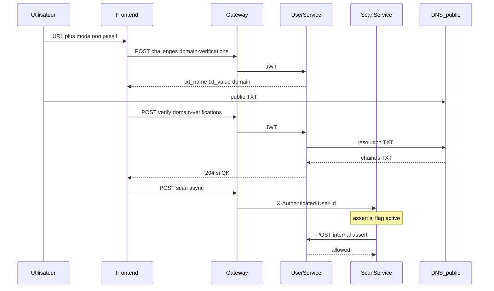

# Vérification d’autorisation — Spécification

Ce document décrit la **vérification que l’utilisateur a l’autorisation de scanner un site** au moyen d’un enregistrement DNS **TXT**. Il s’agit d’une **spécification produit / technique** pour le **Scanner 2** (tests actifs).

**Guide utilisateur (parcours hub, sans détail d’implémentation) :** [verification-dns.md](verification-dns.md) — [English: DNS domain verification](en/dns-domain-verification.md).

**État d’implémentation :** livré dans le backend (user-service : tables `domain_verifications` / `domain_verification_challenges`, API TXT, route interne `assert` ; scan-service : garde-fou sur `POST /api/scan/async`, `multi-async` et endpoints internes si `AUTHORIZATION_CHECK_ENABLED=true` ; scheduler user-service : scans planifiés non passifs ignorés si le domaine n’est pas vérifié). **Par défaut** (`AUTHORIZATION_CHECK_ENABLED` absent ou `false`), le comportement reste celui d’avant (aucun blocage DNS). Voir [ROADMAP-MVP-1.2.0.md](roadmaps/versions/ROADMAP-MVP-1.2.0.md).

**Quand ça s’applique :** uniquement si **`AUTHORIZATION_CHECK_ENABLED=true`** (voir § Environnement et [VARIABLES-ENVIRONNEMENT.md](VARIABLES-ENVIRONNEMENT.md)). Sinon, aucun contrôle DNS.

---

## Contexte

| Mode de scan (`scan_mode`) | Vérification DNS (si flag activé) |
|----------------------------|-------------------------------------|
| **`passive`** | Non. Toute URL autorisée (sous réserve des garde-fous habituels : SSRF, liste noire, etc.). |
| **Non passif** (`intrusive`, `custom`, `destructive`, …) | **Oui.** Le domaine de l’URL (voir § Extraction) doit être **vérifié et non expiré** pour le **compte** qui lance le scan. |

La vérification DNS prouve que l’utilisateur peut faire publier un enregistrement sur la zone du **domaine enregistrable (eTLD+1)** de la cible. Elle ne remplace pas une autorisation légale d’audit : elle limite le risque d’abus sur des domaines non contrôlés.

---

## Méthode : vérification DNS (TXT)

### Vue d’ensemble du fonctionnement (implémentation actuelle)

1. **Normalisation** : à partir de l’URL saisie (ex. `https://www.immosphere.co/chemin`), le backend calcule le **domaine eTLD+1** (ex. `immosphere.co`) avec la même logique partout (`registered_domain_from_url` dans le package `common`).
2. **Challenge** : l’API crée ou met à jour une ligne dans **`domain_verification_challenges`** : un **secret** est généré (`secureops-verify-` + octets aléatoires), stocké en base sous forme de **hash SHA-256** (le clair n’est jamais stocké). Le navigateur affiche le **nom TXT** `_secureops-verify.<domaine>` et la **valeur** à coller dans la zone DNS.
3. **Preuve** : l’utilisateur crée l’enregistrement **TXT** chez son hébergeur DNS et attend la propagation (souvent quelques minutes, parfois plus).
4. **Vérification côté serveur** : au clic sur « Vérifier », le **user-service** interroge le DNS public (bibliothèque **dnspython**, requête TXT sur le FQDN `_secureops-verify.<domaine>`). Pour chaque chaîne TXT renvoyée, le serveur calcule le hash et le compare au hash du challenge. Si **au moins une** chaîne correspond, le challenge est validé.
5. **Persistance** : insertion dans **`domain_verifications`** (`user_id`, `domain`, `verified_at`, `expires_at`), suppression des challenges pour ce domaine. Contrainte **`UNIQUE(domain)`** : un même eTLD+1 ne peut être « possédé » au sens produit que par **un** compte à la fois (tant que la ligne existe).
6. **Autorisation de scan** : quand un scan **non passif** est demandé, le **scan-service** appelle en interne le user-service (**assert**, détaillé dans la section *Intégration avec le lancement de scan* ci-dessous) avec le `cognito_sub` de l’utilisateur et le domaine eTLD+1 dérivé de l’URL. Si la ligne existe, n’est pas expirée, et appartient à cet utilisateur → scan autorisé ; sinon → **403** avec détail structuré.



### Principe

L’utilisateur ajoute un enregistrement **TXT** dans la zone DNS du domaine à scanner. Seul le propriétaire ou l’administrateur du domaine peut effectuer cette action. Si l’enregistrement est présent et correct, le scan est autorisé.

Références : Let's Encrypt (HTTP-01, DNS-01), Google Search Console, services de vérification de domaine.

### Enregistrement attendu

| Champ | Valeur |
|-------|--------|
| **Type** | TXT |
| **Nom / Host** | `_secureops-verify` (sous-domaine du domaine à scanner) |
| **Valeur** | Token unique généré par SecureOps (ex. `secureops-verify-abc123xyz`) |

Exemple pour `example.com` :
```
_secureops-verify.example.com.  TXT  "secureops-verify-abc123xyz"
```

**Guillemets :** la valeur TXT est une seule chaîne ; les guillemets dans les fichiers de zone sont une convention d’affichage. À la comparaison, normaliser (trim, traiter les segments TXT renvoyés par le résolveur comme des chaînes distinctes).

**Plusieurs enregistrements TXT :** un même nom peut avoir plusieurs entrées TXT. La vérification réussit si **au moins une** entrée correspond **exactement** au token attendu (après normalisation), ce qui permet d’ajouter le token SecureOps sans retirer d’autres TXT existants sur le même host.

---

## Extraction du « domaine » depuis l’URL

Décisions **retenues** dans l’implémentation (pour cohérence UX, base de données et nom DNS à interroger) :

| Sujet | Décision |
|--------|----------------|
| **Hôte saisi** | À partir de l’URL (ex. `https://www.example.com/path`), extraire le **hostname** (ici `www.example.com`). |
| **Domaine enregistrable (eTLD+1)** | Normalisation avec **`tldextract`** (package `common`) : fonction `registered_domain_from_url` (ex. `example.com` pour `www.example.com` et `api.example.com`). |
| **Sous-domaine explicite** | Si la politique produit est « vérifier l’hôte exact », le domaine à lier au compte est `blog.example.com` et le TXT est `_secureops-verify.blog.example.com`. |
| **IDN** | Stocker et résoudre en **punycode** (`xn--…`) ; afficher le domaine en Unicode dans l’UI. |
| **Cohérence** | Une fois la règle choisie (registrable vs FQDN), l’enregistrement en base, le libellé affiché et le nom `_secureops-verify.<domaine>` doivent utiliser la **même** chaîne normalisée. |

Le tableau « Sous-domaines » ci-dessous rappelle l’alternative « parent vs enfant » selon cette politique.

---

## Flux technique

### 1. Demande de vérification (hub scanner, modes non passifs)

- L’utilisateur choisit un **mode non passif** et saisit l’URL à scanner (ex. `https://example.com`)
- Le backend extrait et normalise le domaine (voir § Extraction du « domaine ») et génère un **token unique** par demande
- Le token est stocké dans la table **`domain_verification_challenges`** (Postgres) avec `domain`, `user_id`, `token_hash`, `created_at`, **`expires_at`** (défaut **7 jours**, variable `DOMAIN_VERIFICATION_CHALLENGE_TTL_DAYS`) — distinct des **90 jours** de validité après succès (`DOMAIN_VERIFICATION_VALIDITY_DAYS`)
- Côté stockage sensible : préférer le **hash** du token (comme un mot de passe à usage unique) ; ne jamais exposer d’anciens tokens dans les logs
- Le frontend affiche l’enregistrement DNS à ajouter (type, nom complet, valeur)

### 2. Vérification

- L’utilisateur publie l’enregistrement TXT chez son DNS
- Clic sur « Vérifier » → le backend effectue une résolution DNS :
  - Requête **TXT** sur le nom `_secureops-verify.<domaine_normalisé>` (ex. `_secureops-verify.example.com.`)
  - Utiliser un résolveur avec **timeout** et nombre de **tentatives** bornés (ex. alignés sur les autres résolutions DNS du produit, typ. quelques secondes)
  - Comparer le token attendu aux chaînes TXT retournées (voir § Enregistrement attendu — plusieurs TXT)
  - En cas de **NXDOMAIN** ou **SERVFAIL** : échec explicite avec message invitant à vérifier la propagation ou la zone
- En cas de succès : enregistrement en base (domaine vérifié pour `user_id`, `verified_at`, `expires_at`)
- **Propagation :** si l’utilisateur clique trop tôt, afficher une erreur claire et permettre de **réessayer** sans régénérer le token (tant que le challenge pending est valide)

### 3. Scan autorisé (modes non passifs)

- Si le domaine est déjà vérifié (et non expiré), le scan peut démarrer directement
- Sinon, le front affiche le bloc de vérification DNS ; sans cela, si le garde-fou est actif, le **scan-service** renvoie **403**
- Selon le mode choisi, le pipeline peut toujours enchaîner tests passifs puis intrusifs ; la contrainte porte sur l’**autorisation** de lancer le job, pas sur le contenu du pipeline

---

## Cache et expiration

- **Durée de validité après succès :** 90 jours (configurable)
- **Durée de vie d’un challenge en attente :** plus courte (ex. 7 jours) pour limiter l’exposition des jetons ; au-delà, nouvelle demande = nouveau token
- **Stockage :** Table `domain_verifications` (user_id, domain, verified_at, expires_at)
- **Ré-vérification :** Après expiration, l’utilisateur doit repasser par le flux (le TXT peut rester en place si la valeur est toujours celle du dernier token valide — sinon mettre à jour l’enregistrement)
- **Révocation implicite :** si le TXT disparaît avant l’expiration, le produit peut soit **conserver** la confiance jusqu’à `expires_at` (simple), soit prévoir une **re-vérif périodique** en arrière-plan (plus strict, plus coûteux)

---

## Intégration avec le lancement de scan

### Côté scan-service (création de job async)

Si **`AUTHORIZATION_CHECK_ENABLED`** est vrai **et** `scan_mode` ≠ `passive` **et** l’appelant est authentifié (header **`X-Authenticated-User-Id`** = `cognito_sub` fourni par le gateway), le scan-service :

1. Normalise l’URL puis dérive le **domaine eTLD+1** comme le user-service.
2. Appelle **`POST {USER_SERVICE_URL}/api/internal/domain-verifications/assert`** avec le corps JSON `{ "cognito_sub": "<sub>", "domain": "<etld1>" }` et le header **`X-Internal-Api-Key`** (même secret que pour les autres routes internes du user-service).
3. Si la réponse indique `allowed: false` ou si le user-service est injoignable (selon cas) → **403** ou **503** avec un détail JSON (`code`, `message`, `domain` le cas échéant).

Points d’entrée concernés : **`POST /api/scan/async`**, **`POST /api/scan/multi-async`** (domaine dérivé de la première URL), et les endpoints internes **`POST /api/internal/scan/run`** et **`/run-multi`** (le **scheduler** envoie **`cognito_sub`** dans le JSON pour que le même contrôle s’applique).

### Côté user-service (scans planifiés)

Avant d’appeler le scan-service pour un scan dû, si le mode est non passif et le flag activé, le scheduler vérifie localement (même règle métier que **assert**) : si le domaine n’est pas vérifié pour l’utilisateur, le run est **ignoré** (log), sans consommer inutilement le quota de la même manière qu’un scan réussi.

### Refus côté client

Réponse typique **403** avec corps du type `{ "detail": { "code": "domain_not_verified", ... } }` pour afficher le parcours DNS dans le hub.

---

## API exposées (via gateway)

Préfixe côté navigateur : **`{GATEWAY}/user`** → le user-service voit les chemins sous **`/api/user/...`**.

| Méthode | Chemin user-service | Auth | Rôle |
|---------|---------------------|------|------|
| `POST` | `/api/user/domain-verifications/challenges` | JWT | Body `{ "url": "<url ou hostname>" }` — crée ou met à jour un challenge ; réponse : `domain`, `txt_name` (FQDN), `txt_value`, `challenge_expires_at`, `already_verified` |
| `POST` | `/api/user/domain-verifications/verify` | JWT | Body `{ "domain": "<domaine ou url normalisable>" }` — résolution TXT + promotion vers `domain_verifications` ; **204** sans corps si succès |
| `GET` | `/api/user/domain-verifications` | JWT | Liste des domaines vérifiés **encore valides** (`expires_at` > maintenant) |
| `DELETE` | `/api/user/domain-verifications/{id}` | JWT | Supprime la ligne de confiance côté produit (ne modifie pas le DNS chez le client) ; **204** |

### Route interne (service à service)

| Méthode | Chemin | Auth | Rôle |
|---------|--------|------|------|
| `POST` | `/api/internal/domain-verifications/assert` | Header **`X-Internal-Api-Key`** | Body `{ "cognito_sub", "domain" }` — réponse `{ "allowed": true/false, "reason": ... }` |

Cette route est appelée par le **scan-service** uniquement ; elle n’est pas exposée au navigateur.

---

## Sécurité et abus

- **Rate limiting** : limiter les demandes de challenge et les appels « Vérifier » par utilisateur et par domaine (éviter énumération et charge sur les résolveurs DNS).
- **Unicité** : un domaine eTLD+1 ne peut être vérifié que pour **un** compte à la fois (`UNIQUE(domain)`).
- **Audit** : journaliser succès / échecs de vérification (sans le secret), `user_id`, domaine, timestamp.
- **Confidentialité du token** : entropie suffisante (ex. ≥ 128 bits aléatoires) ; préfixe `secureops-verify-` pour identification humaine.

---

## Environnement

| Environnement | Comportement typique |
|----------------|----------------------|
| **Production** | `AUTHORIZATION_CHECK_ENABLED=true` recommandé ; le scan-service doit joindre le user-service (`USER_SERVICE_URL`) avec la **même** `USER_SERVICE_INTERNAL_API_KEY` que le user-service. |
| **Staging** | Idem prod ou test avec flag selon besoin. |
| **Développement / local** | Souvent `AUTHORIZATION_CHECK_ENABLED=false` ou absent : aucun blocage ; utile pour tester les scans sans DNS. |

**Variables utiles** (détail et exemples dans [VARIABLES-ENVIRONNEMENT.md](VARIABLES-ENVIRONNEMENT.md)) :

| Variable | Rôle |
|----------|------|
| `AUTHORIZATION_CHECK_ENABLED` | Si `true` / `1` / `yes` : garde-fou actif côté scan-service **et** scheduler user-service. |
| `USER_SERVICE_URL` | URL de base du user-service pour les appels **assert** depuis le scan-service (ex. `http://localhost:8011` en local, `http://user-service:8011` en Docker). |
| `USER_SERVICE_INTERNAL_API_KEY` | Secret partagé : header `X-Internal-Api-Key` sur `/api/internal/domain-verifications/assert` (aligné gateway / user-service). |
| `DOMAIN_VERIFICATION_CHALLENGE_TTL_DAYS` | (user-service) Durée de vie d’un challenge ouvert (défaut 7). |
| `DOMAIN_VERIFICATION_VALIDITY_DAYS` | (user-service) Durée de validité après vérification réussie (défaut 90). |

---

## Cas particuliers

### DNS privé / résolution impossible

Si la résolution DNS échoue (timeout, domaine derrière DNS privé, propagation en cours) :

- **Option A :** Fallback sur case à cocher + avertissement renforcé
- **Option B :** Refuser le scan et demander de réessayer plus tard
- À configurer selon la politique de sécurité

### Sous-domaines

- `blog.example.com` → soit TXT sur `_secureops-verify.blog.example.com` (hôte exact), soit sur `_secureops-verify.example.com` si la politique **étend** la preuve du domaine parent à tous les sous-domaines. Les deux ne doivent pas être mélangées sans règle claire affichée à l’utilisateur.

### CNAME sur le nom de vérification

- Si `_secureops-verify.example.com` est un **CNAME**, les enregistrements TXT doivent se trouver sur la **cible** du CNAME (comportement DNS standard). Recommandation : documenter côté UI « en cas de CNAME, placez le TXT sur la cible indiquée par votre hébergeur ».

### API publique

- Les appels avec clé API : le domaine peut être pré-vérifié dans le compte de l’utilisateur
- Ou : acceptation préalable via CGU/documentation (l’utilisateur certifie avoir les droits sur les domaines qu’il scanne)

---

## Modèle de données (implémentation Postgres)

Migration Alembic **`0023`** (user-service) :

- **`domain_verifications`** : `id` (UUID), `user_id` (FK → `users.id`), `domain` (varchar, **`UNIQUE`** au niveau global), `verified_at`, `expires_at` (timestamptz). Un seul propriétaire actif par **nom de domaine** normalisé.
- **`domain_verification_challenges`** : `id`, `user_id`, `domain`, `token_hash` (64 caractères hex), `created_at`, `expires_at` ; contrainte **`UNIQUE(user_id, domain)`** pour un challenge actif par couple utilisateur / domaine.

Index pour les lectures fréquentes par utilisateur et expiration des challenges.

---

## Références

- [RFC 1035 – DNS](https://tools.ietf.org/html/rfc1035)
- [RFC 7208 – SPF (TXT sur un host ; utile pour référence sur multi-TXT)](https://tools.ietf.org/html/rfc7208)
- [Let's Encrypt – DNS-01 challenge](https://letsencrypt.org/docs/challenge-types/#dns-01-challenge)
- [Google Search Console – Vérification de propriété](https://support.google.com/webmasters/answer/9008080)

---

## Glossaire rapide

| Terme | Sens dans ce document |
|--------|------------------------|
| **Domaine normalisé** | Chaîne unique utilisée pour le DNS et la base (IDN en punycode si besoin). |
| **Challenge** | Demande de vérification en cours, avant succès TXT. |
| **Token** | Secret affiché une fois à coller dans le TXT. |
| **Assert** | Appel interne scan-service → user-service pour savoir si `cognito_sub` + `domain` sont autorisés avant de créer un job non passif. |
